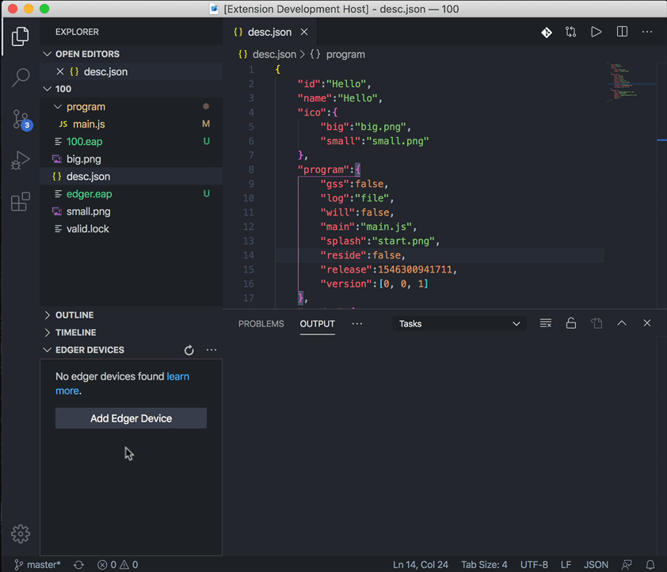
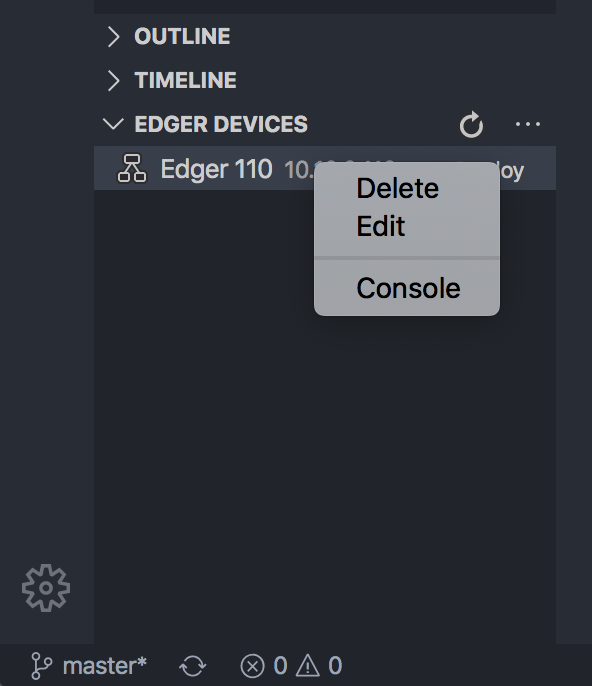
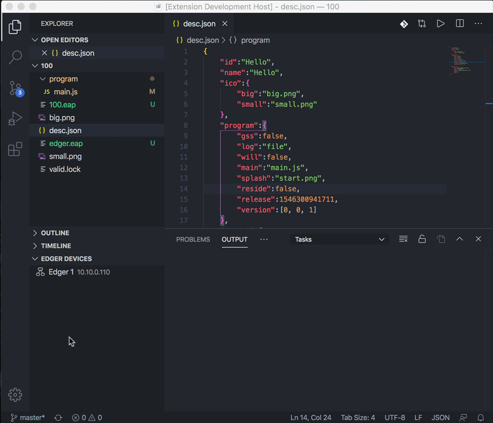
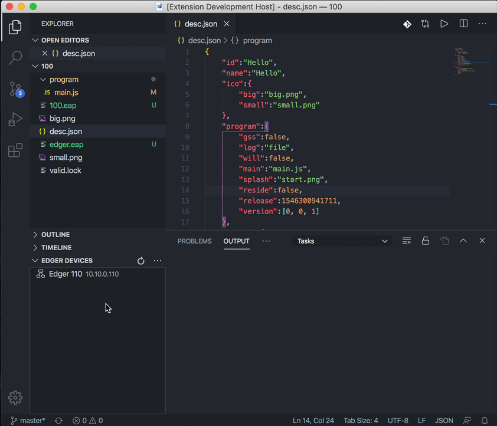
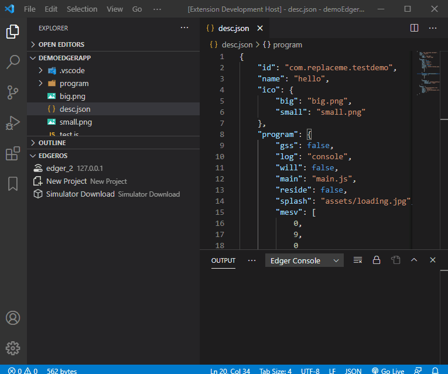
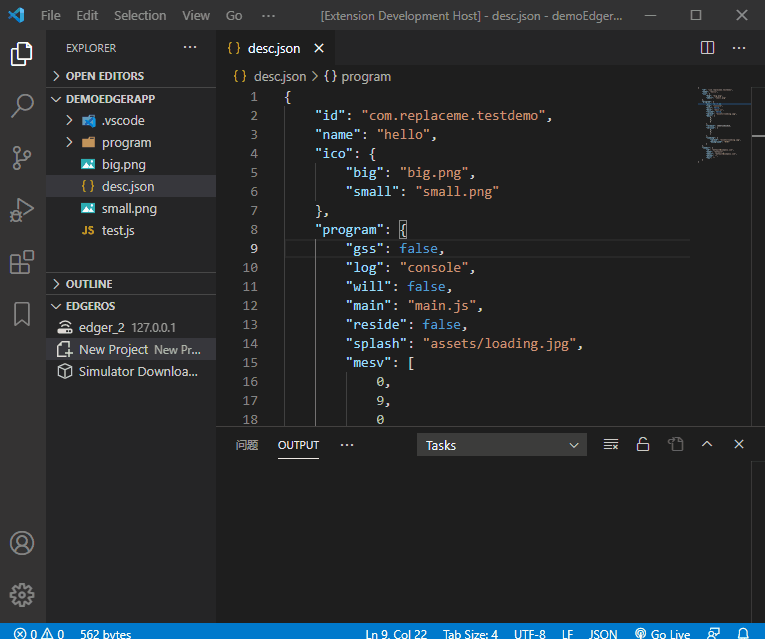
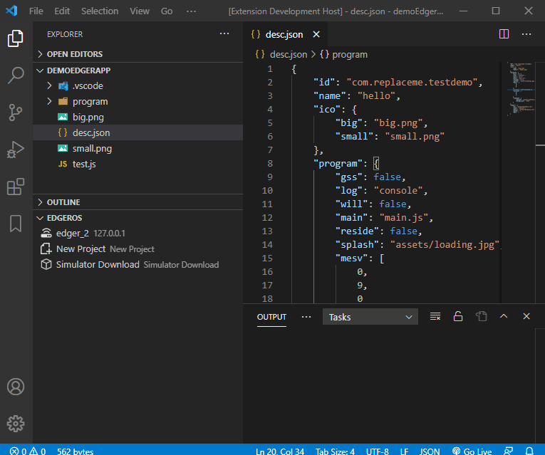

# EdgerOS VSC Extension README

EdgerOS VSC Extension includes a set of tools for EdgerOS developers to **pack**,**create**, **upload**, **install** and **update** EdgerOS applications on your Edger devices. The extension can also validate your desc.json before deployment and monitor app execution status on your device.

It also can manage your Edger devices, including device password. Make sure your Edger device **developer** mode is set on.

## Features

### Add Device

Before deploying your app to Edger device, you should add it to your workspace first.

By clicking the "Add Edger Device" button or "Add" menu item, enter the ip address of your Edger device, give it a nick name and you are good to go.

> Tip: Make sure your computer and Edger devices are in the same network.

### Edit Device

Device information can be edited via context menu on device item in the tree view.

Right click on your device item, then click on the "Edit" menu item. Update the ip address or device nickname as you need.

### Delete Device

The "Delete" context menu can be used to delete device from your device list.

### Deploy App

Once your app is ready to be deployed on your Edger device. You can select the target device and click on the "Deploy" button to deploy your app and test.

Before deployment, device password will be asked and verified during deployment. The content of your app's desc.json will be validated as well.

### Device Console

Device Console can be used to show the execution status of your app on target Edger device.

Device Console can be open via Edger device context menu item "Console". Console message can be found in the **OUTPUT** window.

### Create a project
You can quickly create an Edger OS development Project by clicking "New Project"

### Device Setting
If the template is too slow to load, you can use "Edgeros Settings" to switch between the template download sites. The current sites are "GitHub" and "Zoho".

## Known Issues

N/A

## Release Notes

### 0.0.9

First release.

-----------------------------------------------------------------------------------------------------------

### For more information

* [EdgerOS Official Site](https://www.edgeros.com)

**Enjoy!**

EdgerOS Team, 2021.3
