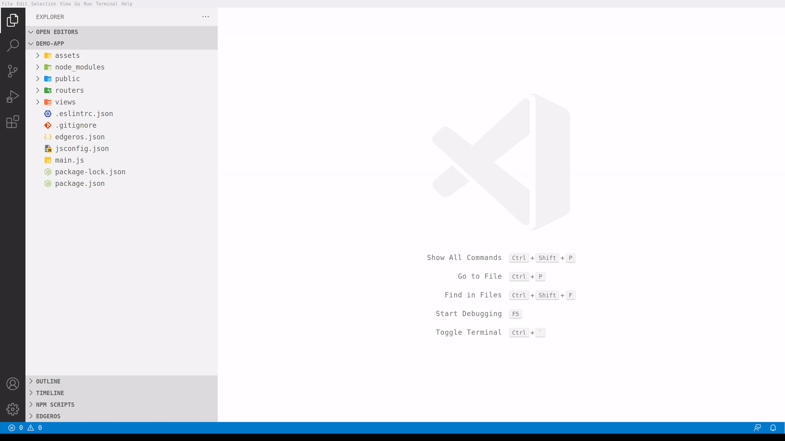
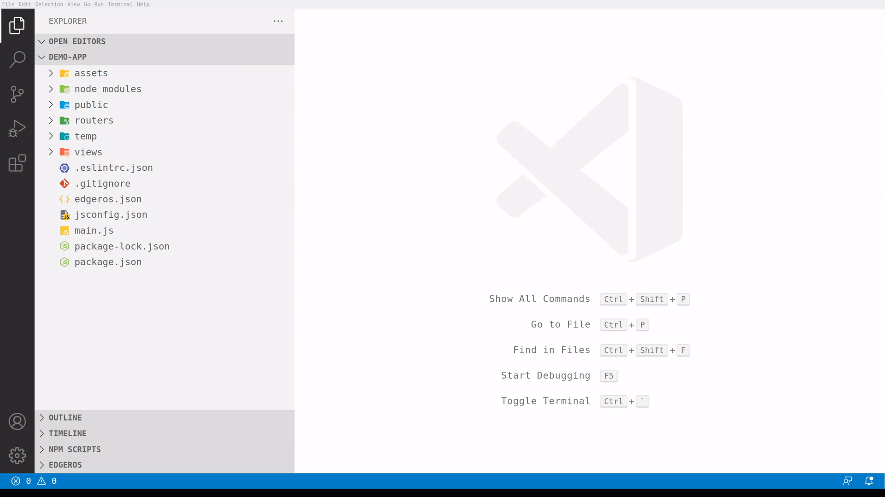
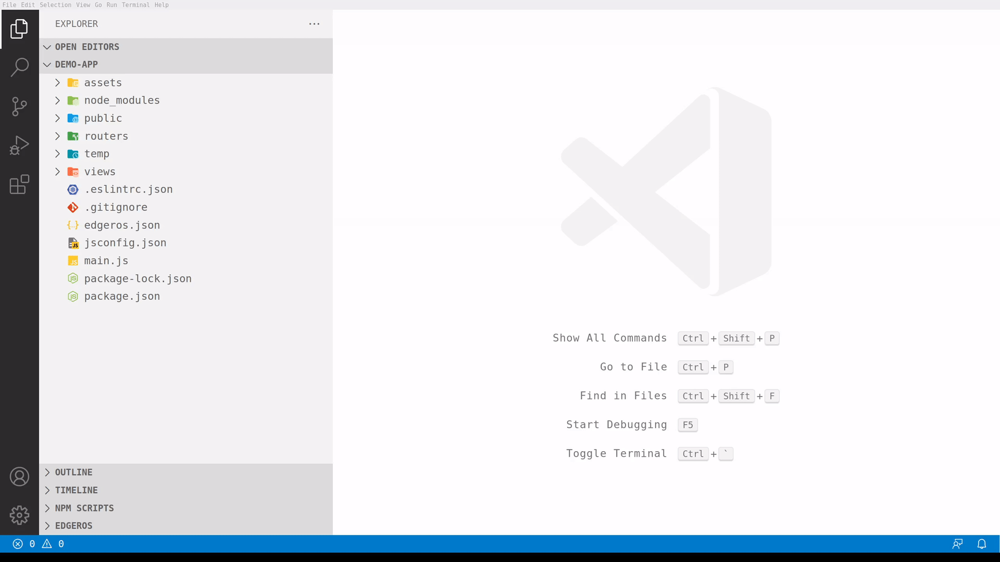

# EdgerOS VSCode Extension

This Extension includes tools for EdgerOS developers to **build**, **install** and **update** EdgerOS applications on your EdgerOS devices. The extension can also validate your edgeros.json before deployment and monitor app execution status on your device.

## Features

### Create a project

You can create an EdgerOS sample project from our built-in templates.  
Note: due to [Github rate limit](https://docs.github.com/en/developers/apps/building-github-apps/rate-limits-for-github-apps), **it might fail when retrieve remote templates**.

### Add Device

Before deploying your app to EdgerOS device, you should add it to your workspace first.
Click "Add  Device" icon, enter the ip address of your device, give it a nick name and you are good to go.

> Tip: Make sure your computer and EdgerOS devices are in the same network. And turn on **developer** mode inside your devices settings before connecting*.

### Edit Device

Click on the device item then you can update the ip address or nickname as you need.

### Deploy App

Once your app is ready to be deployed. Select the target device and click on the "Deploy" icon to deploy your app.
Before deployment, device password will be asked and verified. The content of your app's edgeros.json will be validated as well.

### Device Console

Device Console can be used to print the application log from your app.

Click the Console icon on the device name then your will find the `EdgerOS` panel inside **OUTPUT** window.

## Release Notes

- version 0.2.0 uses new project structure, [check here](CHANGELOG.md#v0.2.0) for more infomation.

### For more information

* [EdgerOS Official Site](https://www.edgeros.com)
